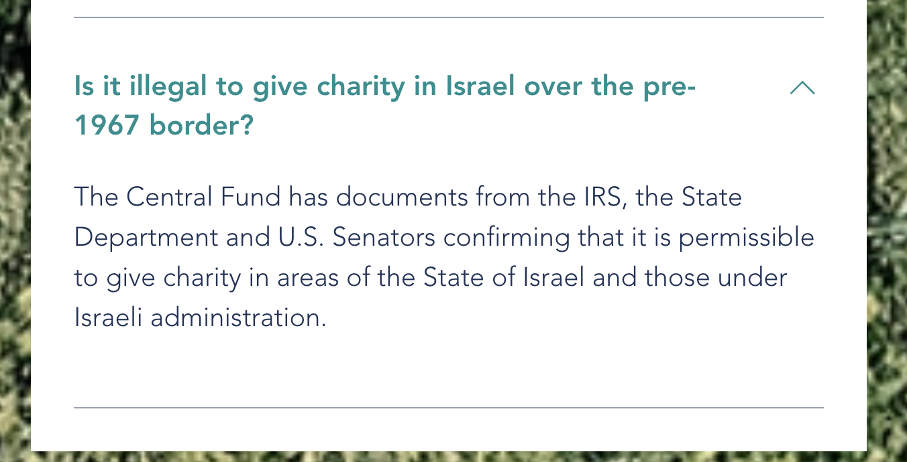
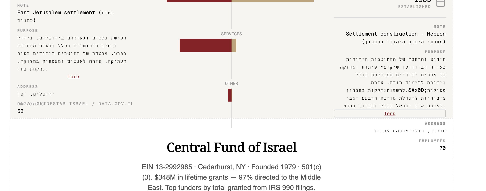

# Central Fund of Israel - Facts

All information accessed on February 22, 2026 from [centralfundofisrael.org](https://www.centralfundofisrael.org/) and related sources.

---

## CFI FAQ on Charitable Giving Beyond the Pre-1967 Border

Source: [https://www.centralfundofisrael.org/faq](https://www.centralfundofisrael.org/faq)

> **Is it illegal to give charity in Israel over the pre-1967 border?**
>
> The Central Fund has documents from the IRS, the State Department and U.S. Senators confirming that it is permissible to give charity in areas of the State of Israel and those under Israeli administration.

---

## Im Tirtzu Donation Page

Source: [https://secured.israelgives.org/en/pay/IMTI](https://secured.israelgives.org/en/pay/IMTI)

### Donate by Check

A US tax-deductible donation to Im Tirtzu can be made via the "Central Fund of Israel." **Please make sure to note Im Tirtzu in the memo line of the check** and mail it to:

> *Central Fund of Israel*
> *C/o Jmark Interiors Inc.*
> *429 Central Avenue*
> *Cedarhurst, NY 11516*

Please include a return address for the receipt. As per the US tax code, checks above $250 will receive a receipt. Tax ID Number: 13-2992985.

### Donate by Bank Transfer

Bank Transfer donations to Im Tirtzu can be sent via the "Central Fund of Israel" (Please reference Im Tirtzu in the memo)

**PLEASE NOTE: Wire transfers UNDER $1,000 will NOT be accepted by the Central Fund of Israel. Instead, please send a check to the address listed above**

**Dime Community Bank**
898 Veterans Memorial Highway
Hauppauge, NY 11788

- **Account Title:** CENTRAL FUND OF ISRAEL
- **Dime Community Bank Routing:** 021406667
- **Account Number:** 5000221843
- **Account Address:** 429 CENTRAL AVE CEDARHURST NY 11516
- **SWIFT code (International wires):** BHNBUS3B

### Screenshots

